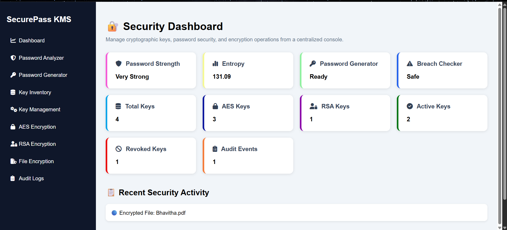

# 🔐 SecurePass KMS

SecurePass KMS is a Flask-based Cryptographic Key Management and Password Security Platform designed to demonstrate practical cybersecurity concepts including password security analysis, cryptographic key lifecycle management, encryption services, audit logging, and secure file protection.

## 🚀 Project Overview

SecurePass KMS provides a centralized security dashboard for managing cryptographic keys, analyzing password strength, preventing password reuse, encrypting files, and monitoring security events through audit logs.

The platform combines multiple cybersecurity concepts into a single web application using Flask, SQLite, AES-256, RSA-2048, and modern password security techniques.

---

## ✨ Features

### 🔑 Password Security Module

* Password Strength Analysis
* Entropy Calculation
* zxcvbn Security Scoring
* Password Breach Detection (Have I Been Pwned API)
* Password Generator
* Password Reuse Prevention using SHA-256 hashing
* Password History Tracking

### 🔐 Cryptographic Key Management

* AES-256 Key Generation
* RSA-2048 Key Pair Generation
* Key Inventory Management
* Key Rotation
* Key Revocation
* Active/Inactive Key Tracking
* Key Lifecycle Monitoring

### 📁 File Encryption

Supports:

* PDF Files
* DOCX Files
* TXT Files

Features:

* Upload Files
* Encrypt Files
* Decrypt Files
* Download Encrypted Files
* Download Decrypted Files

### 🛡 Encryption Services

#### AES Encryption

* AES-256 Encryption
* AES Decryption
* Secure Key Storage

#### RSA Encryption

* RSA-2048 Encryption
* RSA Decryption
* Public/Private Key Pair Management

### 📊 Security Dashboard

Real-Time Analytics:

* Total Keys
* AES Keys
* RSA Keys
* Active Keys
* Revoked Keys
* Passwords Generated
* Audit Events
* Recent Security Activity Feed

### 📝 Audit Logging

Tracks:

* AES Key Generation
* RSA Key Generation
* Key Revocation
* File Encryption
* File Decryption

Audit information includes:

* Action
* Details
* Timestamp

---

## 🏗 System Architecture

```text
User
 │
 ▼
Flask Web Interface
 │
 ├── Security Dashboard
 ├── Password Analyzer
 ├── Password Generator
 ├── Key Management
 ├── File Encryption
 │
 ▼
Business Logic Layer
 │
 ├── AES Encryption Module
 ├── RSA Encryption Module
 ├── Password Security Engine
 ├── Audit Logger
 │
 ▼
SQLite Database
```

---

## 🛠 Technology Stack

### Backend

* Python
* Flask

### Database

* SQLite

### Security Libraries

* cryptography
* hashlib
* secrets
* zxcvbn
* requests

### Frontend

* HTML5
* CSS3
* JavaScript
* Font Awesome

---

## 📂 Project Structure

```text
SecurePass-KMS
│
├── app.py
│
├── database
│   └── kms.db
│
├── kms
│   ├── encryption.py
│   ├── decryption.py
│   ├── rsa_encryption.py
│   ├── rsa_decryption.py
│   ├── key_manager.py
│   ├── revocation.py
│   ├── audit_logger.py
│   ├── password_history.py
│   └── file_encryption.py
│
├── password_analyzer
│   ├── analyzer.py
│   ├── entropy.py
│   ├── breach_checker.py
│   └── zxcvbn_analyzer.py
│
├── password_generator
│   └── generator.py
│
├── templates
│
├── static
│
├── uploads
├── encrypted_files
├── decrypted_files
│
└── requirements.txt
```

---

## ⚙ Installation

### Clone Repository

```bash
git clone https://github.com/vbhavitha/SecurePass-KMS.git

cd SecurePass-KMS
```

### Create Virtual Environment

```bash
python -m venv venv
```

### Activate Virtual Environment

Windows:

```bash
venv\Scripts\activate
```

### Install Dependencies

```bash
pip install -r requirements.txt
```

### Run Application

```bash
python app.py
```

Open:

```text
http://127.0.0.1:5000
```

---

## 📸 Screenshots

### Security Dashboard



### Password Analyzer


### Key Inventory


### File Encryption


### Audit Logs


---

## 🔒 Security Concepts Demonstrated

* Password Security Analysis
* Password Entropy Measurement
* Breach Detection
* Cryptographic Key Management
* AES-256 Encryption
* RSA-2048 Encryption
* Secure File Protection
* Audit Logging
* Key Rotation
* Key Revocation
* Password Reuse Prevention

---

## 🎯 Learning Outcomes

This project demonstrates practical implementation of:

* Applied Cryptography
* Key Management Systems (KMS)
* Secure Software Development
* Web Application Security
* Password Security Engineering
* File Protection Mechanisms
* Security Monitoring and Auditing

---

## 👩‍💻 Author

**Bhavitha Vakkalagadda**

Computer Science and Engineering (Cybersecurity & Blockchain Technology)

GitHub: https://github.com/vbhavitha

LinkedIn: https://www.linkedin.com/in/vakkalagadda-bhavitha/

Portfolio: https://bhavitha-portfolio-3apq.vercel.app/

---

## 📜 License

This project is developed for educational and portfolio purposes.
